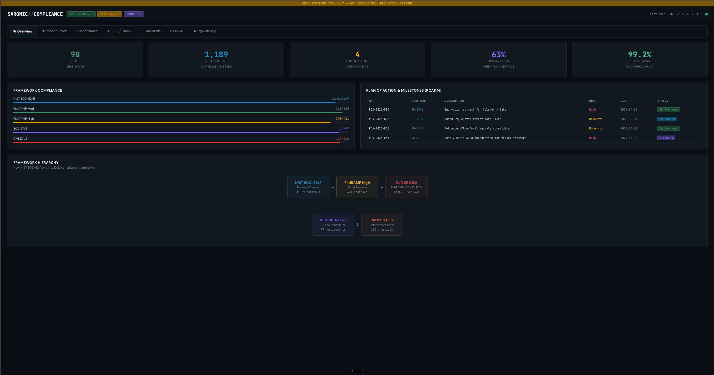

# Saronic Compliance Dashboard

A React TypeScript dashboard visualizing DoD and federal security compliance posture across NIST 800-53r5, FedRAMP, CMMC 2.0, SPRS scoring, OSCAL integration, and FedRAMP equivalency.

[](LICENSE)
[](https://www.typescriptlang.org/)
[](https://react.dev/)
[](https://vite.dev/)
[](https://Jibbscript.github.io/MilTech-FedRAMP-Compliance-Dashboard/)



## About

Saronic Compliance Dashboard presents complex regulatory compliance data in a clear, actionable interface. It tracks control implementation status, inheritance chains, impact level requirements, and scoring across multiple federal security frameworks.

Built as a demonstration of how defense and federal technology organizations can visualize their compliance posture. **All displayed data is synthetic and for demonstration purposes only.**

## Features

- **Overview** — Summary metrics across all compliance frameworks with control implementation status
- **Impact Levels** — DoD SRG Impact Level comparison (IL2 through IL6) with control requirements
- **Inheritance** — Compliance inheritance chain visualization from FedRAMP through CMMC
- **SPRS/CMMC Simulator** — Interactive NIST 800-171 Rev 2 control toggle with live SPRS score calculation (110-point scale, weights of 1/3/5)
- **Guardrails** — Security guardrail status tracking across operational categories
- **OSCAL Integration** — OSCAL adoption readiness assessment with RFC-0024 timeline (Sept 30, 2026)
- **FedRAMP Equivalency** — Side-by-side comparison of FedRAMP authorization vs. DoD FedRAMP equivalency (per Jan 2024 DoD CIO memo)

## Built With

- **React 19** — Hooks-based component architecture with `useReducer` for simulator state
- **TypeScript 6** — Full type safety across domain types and UI props (strict mode, `noUncheckedIndexedAccess`)
- **Vite 8** — Fast build tooling with HMR and CSS Modules support
- **CSS Modules** — Scoped styling with CSS custom properties for theming and responsive design tokens
- **No external UI library** — All components (Badge, Card, MetricBox, ProgressBar, TabBar, FlowDiagram) built from scratch

## Getting Started

### Prerequisites

- [Node.js](https://nodejs.org/) 18+ (LTS recommended)
- npm 9+ (included with Node.js)

### Installation

1. Clone the repository
   ```bash
   git clone https://github.com/Jibbscript/MilTech-FedRAMP-Compliance-Dashboard.git
   cd MilTech-FedRAMP-Compliance-Dashboard
   ```

2. Install dependencies
   ```bash
   npm install
   ```

3. Start the development server
   ```bash
   npm run dev
   ```

4. Open [http://localhost:3000](http://localhost:3000) in your browser

### Build for Production

```bash
npm run build      # TypeScript check + Vite production build
npm run preview    # Preview the production build locally
```

## Project Structure

```
src/
├── app/                    # Root shell (header, CUI banner, tab routing)
├── components/             # Shared UI primitives (Badge, Card, FlowDiagram, etc.)
├── features/               # Feature-grouped tabs
│   ├── overview/           #   Component + styles + data co-located
│   ├── impact-levels/
│   ├── inheritance/
│   ├── sprs/               #   Interactive SPRS/CMMC simulator
│   ├── guardrails/
│   ├── oscal/
│   └── equivalency/
├── hooks/                  # useSPRSSimulator (useReducer-based state)
├── lib/                    # Pure functions (SPRS scoring, color utilities)
├── styles/                 # Global CSS reset + design tokens
├── theme/                  # JS mirror of CSS custom properties
└── types/                  # Domain types (compliance.ts) + UI prop types
```

## License

Distributed under the MIT License. See [LICENSE](LICENSE) for the full text.
